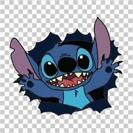
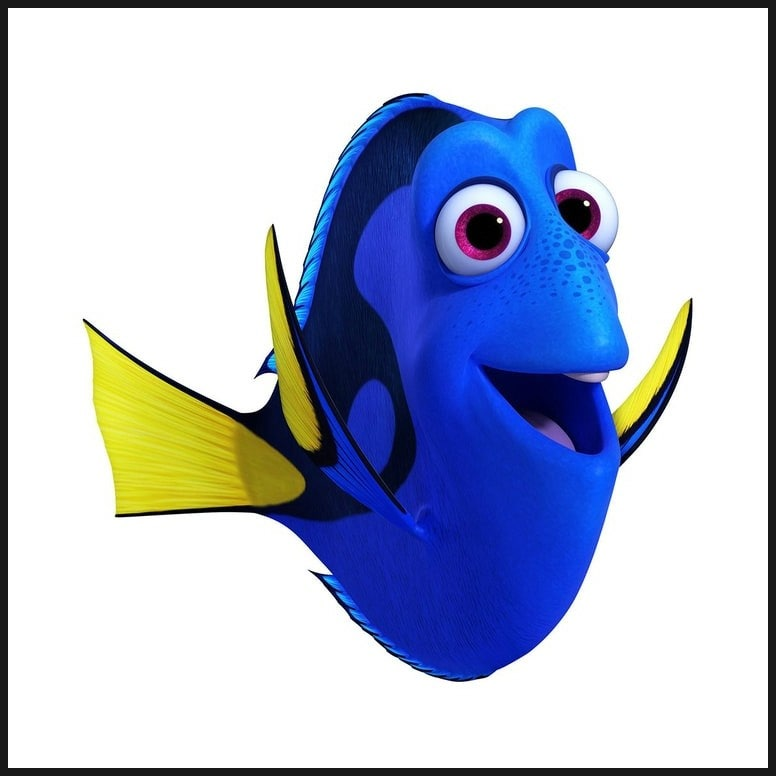

# ↪ RETURNS
## 머신러닝 기반 보험 가입 고객 이탈 예측 및 유지 전략 제안 프로젝트

## 📑 목차 (Table of Contents)
1. [📌 프로젝트 개요](#1-프로젝트-개요)
2. [🖐🏻 팀 소개](#2-팀-소개)
3. [🛠 기술 스택](#3-기술-스택)
4. [📊 데이터 분석 및 전처리](#4-데이터-분석-및-전처리)
5. [🧠 모델링 및 평가](#5-모델링 및 평가)
6. [📈 주요 기능 및 화면](#6-주요-기능-및-화면)
7. [📁 프로젝트 구조](#7-프로젝트-구조)

## 1. 📌 프로젝트 개요

📋 서비스 배경

- 보험 산업에서 신규 고객 유치 비용은 기존 고객 유지 비용보다 약 5~7배 더 높습니다.\
Team RETURNS는 보험사의 유지율(Retention Rate)을 극대화하기 위해 데이터 기반의 이탈 예측 솔루션을 제안합니다.

🎯 핵심 목표
- B2B 솔루션: 보험사가 보유한 방대한 고객 데이터를 활용하여, 해지 가능성이 높은 고객을 사전에 식별합니다.
- 비즈니스 가치: 신규 고객 유치보다 효율적인 **기존 고객 유지(Retention)** 를 통해 보험사의 운영 비용을 절감하고 손해율을 관리합니다.
- 데이터 기반 의사결정: 단순 감이 아닌, 머신러닝 모델이 산출한 이탈 확률을 바탕으로 마케팅 자원을 집중 투입합니다.

💡 기대 효과
- 이탈률 감소: 데이터 기반의 타겟팅을 통한 효율적인 고객 관리
- LTV(고객 생애 가치) 증대: 장기 가입 고객 확보를 통한 보험사 수익성 개선

## 2. 🖐🏻 팀소개
##  Team RETURNS
<table align="center">
  <tr>
    <td align="center" width="120">
      
    </td>
    <td align="center" width="120">
      
    </td>
    <td align="center" width="120">
      
    </td>
    <td align="center" width="120">
      
    </td>
    <td align="center" width="120">
      
    </td>
    <td align="center" width="120">
      
    </td>
  </tr>
  <tr>
    <td align="center"><b>김이선</b></td>
    <td align="center"><b>박은지</b></td>
    <td align="center"><b>박기은</b></td>
    <td align="center"><b>이선호</b></td>
    <td align="center"><b>위희찬</b></td>
    <td align="center"><b>홍지윤</b></td>
  </tr>
  <tr>
    <td align="center">FullStack</td>
    <td align="center">DB</td>
    <td align="center">FullStack</td>
    <td align="center">PM</td>
    <td align="center">FullStack</td>
    <td align="center">FullStack</td>
  </tr>
  <tr>
    <td align="center"><a href="https://github.com/kysuniv-cyber"></a></td>
    <td align="center"><a href="https://github.com/lo1f0306"></a></td>
    <td align="center"><a href="https://github.com/gieun-Park"></a></td>
    <td align="center"><a href="https://github.com/fridayeverynote-cell"></a></td>
    <td align="center"><a href="https://github.com/dnlgmlcks"></a></td>
    <td align="center"><a href="https://github.com/jyh-skn"></a></td>
  </tr>
</table>


## 3. 🛠 기술스택
- Language & Analysis:     


- Machine Learning: 
  - Core Model: HistGradientBoostingClassifier 
  

- Service: 


## 4. 📊 데이터 분석 및 전처리

## 5. 🧠 모델링 및 평가

## 6. 📈 주요 기능 및 화면
## 7. 📂 프로젝트 구조 (Project Structure)

```text
PRED-CUST-CHURN/
├── data/                    # 데이터 폴더
├── analysis/                # 개별 가설 분석 폴더
├── src/                     # 공통 모듈 (팀원 공유용)
│   └── preprocess.py        # 데이터 로드 및 전처리 클래스
├── pages/                   # Streamlit 웹 어플리케이션
│   ├── churn_predictor.py   # 이탈 예측 화면
│   ├── entry.py             # 진입 화면
│   └── risk_watchlist.py    # 이탈 확률이 높은 고객 리스트 화면
├── model/                   # 학습된 모델 저장 폴더
├── requirements.txt         # 필요 라이브러리 목록
└── app.py                   # 실행 streamlit
]()